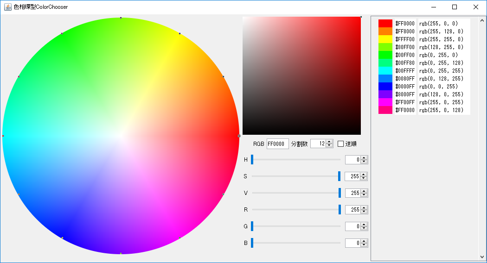

# 色相環型ColorChooser
[](./LICENSE)
[](https://github.com/ohmae/WheelColorChooser/releases)

同一彩度・明度で色相を均等に分割した色相環の色を一括して選択できるColorChooserです。



Javaで書いているため、
Javaランタイムが動作する環境であれば使えると思います。

## Usage

[Latest release](https://github.com/ohmae/WheelColorChooser/releases/latest)
から「WheelColorChooser.jar」
をダウンロードして下さい。

jarファイルが関連付けられていればダブルクリックで

コマンドラインの場合
以下のようにするとスクリーンショットのWindowが立ち上がります。
```
java -jar WheelColorChooser.jar
```

使用方法は見ての通りで、クリックした位置の色を選択し、
そこを中心として分割数で入力した数分、
色相を均等に分割した色を一括して選択することができます。

## Author
大前 良介 (OHMAE Ryosuke)
http://www.mm2d.net/

## License
[MIT License](https://github.com/ohmae/WheelColorChooser/blob/master/LICENSE)
